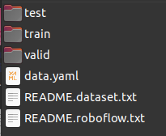
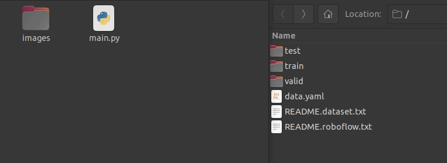
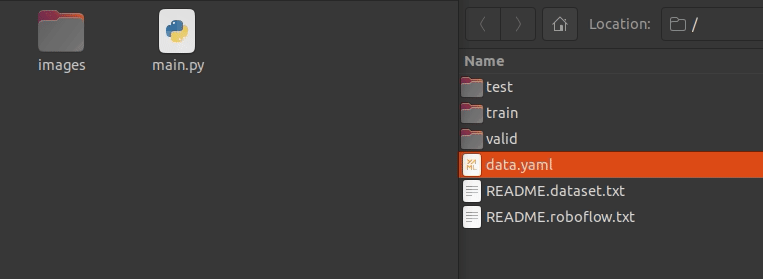

# Dataset Augmentation for YoloV8

## Method

This project utilizes OpenCV and the Albumentations module to apply pipeline transformations to a DataSet and generate lots of images for training enhancement.

## Requirements

- Ubuntu 20.04 (recommended)
- Python 3.6 or higher
- OpenCV-python
```
$ pip3 install opencv-python
```

- Albumentations
```
$ pip3 install -U albumentations
```
- A labeled DataSet in YoloV8 format (you can make your own using Roboflow, for example). It should look like this:



## Utilization
- Create a directory on the project's root folder called "images", if there isn't one already.
```
$ mkdir images
```
- Place both dataset images (train/images/) and label text files (train/labels/) inside the "images" folder, everything together.


- Place the "data.yaml" file from the dataset inside the project's root folder.


- Now, you can choose the transformation functions from Albumentations that are going to be applied to your dataset. Open the "main.py" file and you'll see a declared object called "transform", like this:

```python
transform = A.Compose([
    A.Affine(scale=(0.5, 1.5), rotate=(-10, 10), shear=(-3, 3), p=0.5),
    A.RandomCrop(width=1008, height=756),
    A.HorizontalFlip(p=0.5),
    A.RandomBrightnessContrast(brightness_limit=0.15, contrast_limit=0.3, p=1.0),
], bbox_params=A.BboxParams(format='yolo', min_area=4000, min_visibility=0.2))
```

- This is the augmentation pipeline. You can change the parameters and the functions that are going to be used. You can also change the output bounding box minimal area and minimum visibility. See the following table for further acknowledge of some transform functions:

| Function                                                            | Result                                       | Parameters                                                                       |
|---------------------------------------------------------------------|----------------------------------------------|----------------------------------------------------------------------------------|
| HorizontalFlip(p=x)                                                 | Flips the image on the Y axis                | p = probability of applying the transform, float 0 to 1.                         |
| VerticalFlip(p=x)                                                   | Flips the image on the X axis                | p = probability of applying the transform, float 0 to 1.                         |
| RandomCrop(width=x, height=y)                                       | Crops a random area from the image           | width and height in pixels.                                                      |
| Affine(scale=(-x, x), rotate=(-y, y), shear=(-z, z), p=w)           | Changes image scale, rotation and distortion | scale = float tuple, rotate = degrees, shear = degrees, p = probability.         |
| RandomBrightnessContrast(brightness_limit=x, contrast_limit=y, p=z) | Random image brightness and contrast         | brightness_limit = float 0 to 1, contrast_limit = float 0 to 1, p = probability. |

You can see all the available augmentation functions accessing the [Albumentations.ai Documentation](https://albumentations.ai/docs/api_reference/augmentations/).

- After that, run the "main.py" file using the Python interpreter. You'll be prompted to verify if all the files are in the correct directories.

- Next, you'll be prompted to input the **augmentation factor**. This corresponds to **how many times you want your dataset to be multiplied by**. If you have 100 images in the "images" directory, for example, and you choose **5** as your augmentation factor, your output is going to be 500 images.

- Your augmented images are going to be generated inside the "transformed_images" folder.

- As the process is finished, you can now upload all the images from the "transformed_images" back to your dataset in Roboflow or any other dataset generator you like.

## Useful Links
- [Albumentations.ai Documentation](https://albumentations.ai/docs/)
- [Roboflow](https://roboflow.com/)
- [YoloV8 Docs](https://docs.ultralytics.com/)
